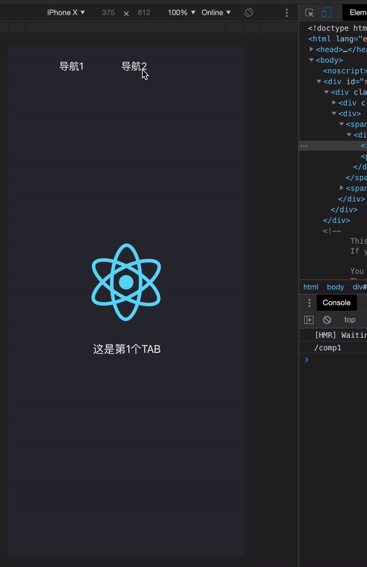

## Overview

English | [简体中文](./README_ZH.md)

🦋 Bee router is a small and exquisite React Router for mobile web project, with only 200 lines of code. Different with react-router，bee router has the following advantages:

- Over ten times smaller volume, which makes it is suitable for mobile web projects with limit of code lines.
- Bee router has the same basic functions with react router, such as route switching and routing events etc. , but reducing rarely-used functions in react router.
- Unlike react router which repeatedly initializes components, bee-router only needs to be initialized once, which greatly saves resources.

## Usage

[Example](https://ilgei.github.io/beerouter/)



## Installation

First step:

[](https://npmjs.org/package/beerouter)

```js
npm install beerouter --save
```

The second step:

```js
import React from "react";
import Comp1 from "./comp/Comp1.jsx";
import Comp2 from "./comp/Comp2.jsx";
import { BeeRouter, BeeRouterEmitter } from "bee-router";

function clickHandler(item) {
  BeeRouter.push("/comp" + item);
}

function App() {
  BeeRouterEmitter.on("router-change", path => {
    console.log(path);
  });

  return (
    <div className="App">
      <div className="nav">
        <div onClick={clickHandler.bind(null, 1)}>导航1</div>
        <div onClick={clickHandler.bind(null, 2)}>导航2</div>
      </div>

      <div>
        <BeeRouter path="/comp1" component={Comp1} index="default" />
        <BeeRouter path="/comp2" component={Comp2} />
      </div>
    </div>
  );
}

export default App;
```

## License

MIT
