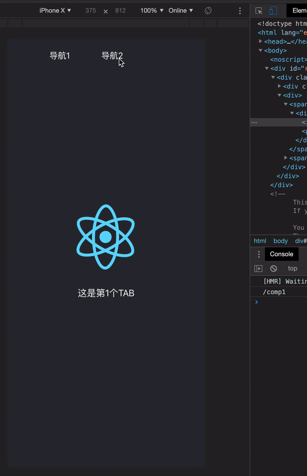

## 简介

[English](./README.md) | 简体中文

🦋 bee-router是一个小巧玲珑的react路由，只有200行代码。与react-router相比，bee-router具有以下优点：

```js
1. 代码体积相差是10几倍, 如果是寸土寸金的移动端开发很适合。
2. 基本功能都在, 路由切换、路由事件等，react-router很多功能你一般用不到。
3. 不同于react-router反复初始化组件, bee-router只需要初始化一次, 大大节省资源。
```

## 示例

[在线示例](https://ilgei.github.io/beerouter/)



## 使用

第一步：

[](https://npmjs.org/package/beerouter)

```js
npm install beerouter --save
```

第二步：

```js
import React from "react";
import Comp1 from "./comp/Comp1.jsx";
import Comp2 from "./comp/Comp2.jsx";
import { BeeRouter, BeeRouterEmitter } from "bee-router";

function clickHandler(item) {
  BeeRouter.push("/comp" + item);
}

function App() {
  BeeRouterEmitter.on("router-change", path => {
    console.log(path);
  });

  return (
    <div className="App">
      <div className="nav">
        <div onClick={clickHandler.bind(null, 1)}>导航1</div>
        <div onClick={clickHandler.bind(null, 2)}>导航2</div>
      </div>

      <div>
        <BeeRouter path="/comp1" component={Comp1} index="default" />
        <BeeRouter path="/comp2" component={Comp2} />
      </div>
    </div>
  );
}

export default App;
```

## License

MIT